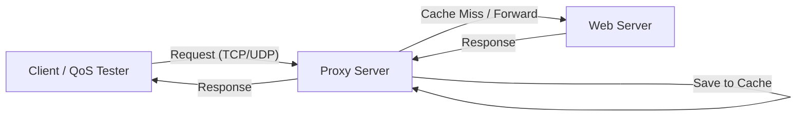

# 🌐 Proxy & Web Server Implementation with QoS Analysis


> **Computer Networking Final Project:** Implementation of a Web Server and Proxy Server using Python Socket Programming, featuring *Caching*, *Multi-threading*, and a *Quality of Service* (QoS) analysis module.

## 📌 Project Overview
This project constructs a simple network simulation consisting of a **Client**, **Proxy Server**, and **Web Server**. The primary objective is to demonstrate how TCP (for HTTP) and UDP protocols operate at the socket level, and how a Proxy handles *request forwarding* and *caching* to improve network efficiency.

Additionally, the system includes a **QoS Analyzer** to measure network quality based on the following parameters:
* **Throughput** (Data transfer speed)
* **Latency / RTT** (Round Trip Time)
* **Jitter** (Packet arrival variance)
* **Packet Loss** (Percentage of lost packets)

## 🏗️ System Architecture

The data communication flow between components is as follows:


🛠️ Features & Technical Implementation
1. Web Server (server.py)
Dual Protocol Support: Runs TCP services (HTTP File Server) and UDP services (Echo Server) in parallel using threading.
HTTP Handling: Serves standard GET requests and fetches files from the local ./www directory.
Security: Basic prevention against Directory Traversal attacks.
2. Proxy Server (proxy.py)
In-Memory Caching: Stores HTTP responses in RAM. If a repeated request is received, the Proxy replies directly from the cache without contacting the Web Server (significantly reducing latency).
Transparent Forwarding: Transparents forwards UDP packets to facilitate QoS testing.
Concurrency: Utilizes threading to handle multiple clients simultaneously without blocking.
3. Client & QoS Tester (client.py)
Interactive Menu: A CLI interface for selecting testing modes.
QoS Measurement: Sends burst packets via UDP to calculate real-time network metrics.
Multi-Client Simulation: Simulates traffic load by running 5 client threads simultaneously.
Logging: Saves the QoS analysis results to qos_result.csv.

```
🚀 How to Run
Prerequisites
Ensure Python 3.x is installed. No external libraries are required (uses standard libraries only).

Step 1: Setup Web Content
Create a www folder and a dummy HTML file to prevent server errors.

Bash
mkdir www
echo "<h1>Hello from Socket Server!</h1>" > www/index.html

Step 2: Run Web Server
Open the first terminal:

Bash
python server.py
# Output: Web Server running on port 8000 (TCP) and 9000 (UDP)

Step 3: Run Proxy Server
Open the second terminal (ensure IP configuration in the script matches your setup, default is 127.0.0.1):

Bash
python proxy.py
# Output: Proxy running on port 8080 (TCP) and 9090 (UDP)

Step 4: Run Client
Open the third terminal:

Bash
python client.py
Use the interactive menu to perform tests:
1. Select Option 2 for HTTP Request testing (Check Proxy logs for Cache Hit/Miss).
2. Select Option 3 for UDP QoS testing.
3. Select Option 4 for Multithreading Client simulation.

```
👥 Credits
This project was developed by: Faisal Surya Saputra Informatics - Telkom University

