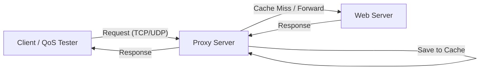

# 🌐 Proxy & Web Server Implementation with QoS Analysis

> **Computer Networking Final Project:** Implementasi Web Server dan Proxy Server menggunakan Python Socket Programming yang dilengkapi dengan mekanisme *Caching*, *Multi-threading*, serta modul analisis *Quality of Service* (QoS).

## 📌 Deskripsi Proyek
Proyek ini membangun simulasi jaringan sederhana yang terdiri dari **Client**, **Proxy Server**, dan **Web Server**. Tujuan utamanya adalah mendemonstrasikan bagaimana protokol TCP (untuk HTTP) dan UDP bekerja di level socket, serta bagaimana Proxy menangani *request forwarding* dan *caching* untuk efisiensi jaringan.

Selain itu, sistem ini memiliki fitur **QoS Analyzer** untuk mengukur kualitas jaringan berdasarkan parameter:
* **Throughput** (Kecepatan transfer data)
* **Latency / RTT** (Waktu tunda)
* **Jitter** (Variasi kedatangan paket)
* **Packet Loss** (Persentase paket hilang)

## 🏗️ Arsitektur Sistem

Alur komunikasi data antar komponen adalah sebagai berikut:

🛠️ Fitur & Implementasi Teknis
1. Web Server (server.py)
Dual Protocol Support: Menjalankan layanan TCP (HTTP File Server) dan UDP (Echo Server) secara paralel menggunakan threading.
HTTP Handling: Melayani request GET standar dan mengambil file dari direktori lokal ./www.
Security: Pencegahan dasar terhadap Directory Traversal.
2. Proxy Server (proxy.py)
In-Memory Caching: Menyimpan respons HTTP di RAM. Jika request berulang diterima, Proxy langsung membalas dari cache tanpa menghubungi Web Server (mengurangi latensi).
Transparent Forwarding: Meneruskan paket UDP secara transparan untuk pengujian QoS.
Concurrency: Menggunakan threading untuk menangani banyak klien secara bersamaan tanpa blocking.
3. Client & QoS Tester (client.py)
Interactive Menu: Antarmuka CLI untuk memilih mode pengujian.
QoS Measurement: Mengirim paket burst via UDP untuk menghitung metrik jaringan secara real-time.
Multi-Client Simulation: Mensimulasikan beban trafik dengan menjalankan 5 thread klien secara simultan.
Logging: Menyimpan hasil analisis QoS ke file qos_result.csv.
📊 Metrik QoS
Metrik dihitung menggunakan rumus berikut dalam kode:

Parameter	Rumus Implementasi
Throughput	(Total Bytes Received * 8) / Total Duration (bps)
Packet Loss	(Lost Packets / Total Packets Sent) * 100 (%)
Latency	Receive Time - Send Time (ms)
Jitter	Rata-rata selisih absolut antar latensi berturut-turut
📂 Struktur Direktori
Plaintext
.
├── server.py        # Script Web Server (TCP Port 8000, UDP Port 9000)
├── proxy.py         # Script Proxy Server (TCP Port 8080, UDP Port 9090)
├── client.py        # Script Client untuk testing dan QoS analysis
├── qos_result.csv   # Log otomatis hasil pengujian QoS
└── www/             # Folder root untuk file HTML
    └── index.html   # File sampel web
🚀 Cara Menjalankan
Prasyarat
Pastikan Python 3.x sudah terinstal. Tidak ada library eksternal yang dibutuhkan (hanya standard library).

Langkah 1: Setup Konten Web
Buat folder www dan file dummy HTML agar server tidak error.

Bash
mkdir www
echo "<h1>Hello from Socket Server!</h1>" > www/index.html
Langkah 2: Jalankan Web Server
Buka terminal pertama:

Bash
python server.py
# Output: Web Server berjalan di port 8000 (TCP) dan 9000 (UDP)
Langkah 3: Jalankan Proxy Server
Buka terminal kedua (pastikan konfigurasi IP di script sesuai, default 127.0.0.1):

Bash
python proxy.py
# Output: Proxy berjalan di port 8080 (TCP) dan 9090 (UDP)
Langkah 4: Jalankan Client
Buka terminal ketiga:

Bash
python client.py
Gunakan menu interaktif untuk melakukan pengujian:
Pilih menu 2 untuk tes Request HTTP (cek apakah Cache Hit/Miss di log Proxy).
Pilih menu 3 untuk tes QoS UDP.
Pilih menu 4 untuk simulasi Multithreading Client.
👥 Kredit
Proyek ini dikerjakan oleh:
Faisal Surya Saputra
Informatics - Telkom University

Parameter,Rumus Implementasi
Throughput,(Total Bytes Received * 8) / Total Duration (bps)
Packet Loss,(Lost Packets / Total Packets Sent) * 100 (%)
Latency,Receive Time - Send Time (ms)
Jitter,Rata-rata selisih absolut antar latensi berturut-turut
